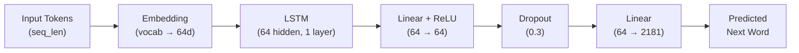

# 🧠 LSTM Next-Word Predictor

A from-scratch language model that predicts the next word in a sequence using an LSTM (Long Short-Term Memory) network — simulating how early neural language models worked before the Transformer era.


---

## ✨ Motivation

I built this project to explore how early neural language models worked before Transformers took over. While modern LLMs are built on Transformers, understanding **sequential models like LSTMs** is foundational to appreciating *why* attention mechanisms were needed in the first place. 

This project implements a complete, minimal language model pipeline from scratch—from text preprocessing and tokenization to model training and deployment. The training corpus consists of text extracted from academic papers, focusing on **machine learning concepts**, the **LSTM architecture**, and the **"Attention Is All You Need"** paper.

---

## 🏗️ Architecture



| Component        | Details                          |
| ---------------- | -------------------------------- |
| **Embedding**    | 2,181 vocab → 64 dimensions      |
| **LSTM**         | 1 layer, 64 hidden units         |
| **Classifier**   | Linear(64→64) → ReLU → Dropout(0.3) → Linear(64→2181) |
| **Parameters**   | ~1.2 MB                          |

---

## 📁 Project Structure

```
Language Model with LSTM/
├── Notebook/
│   └── Lstm One Word Predictor.ipynb   # Training notebook (data prep, training loop)
├── app.py                              # Streamlit web app for inference
├── README.md
├── Loss plot.png                       # Training loss curve
├── Artifacts/
│   ├── mini_lm.pt                      # Saved model weights
│   └── tokenizer.json                  # Word-to-ID mapping (custom tokenizer)
└── src/
    └── architecture.py                 # WordPred model definition (PyTorch)
```

---

## 🚀 Getting Started

### Prerequisites

```bash
pip install torch streamlit pillow
```

### Run the app

```bash
streamlit run app.py
```

The app will open at `http://localhost:8501`. Enter a prompt related to machine learning or LSTMs and the model will attempt to complete your sentence.

### Train from scratch

Open `Notebook/Lstm One Word Predictor.ipynb` in Jupyter and run all cells. The notebook handles:

1. Text extraction & cleaning
2. Tokenizer construction
3. Dataset creation (sliding window)
4. Model training (100 epochs)
5. Saving weights to `Artifacts/`

---

## 📈 Training & Observations

### Training Loss
The model was trained for **100 epochs** using cross-entropy loss, with the loss decreasing steadily from **~7.0 to ~1.0**. 

<p align="center">
  
</p>

### Key Observations & Limitations
While analyzing the model's performance, I noticed a few major bottlenecks:
* **Severe Overfitting:** Even with continuous hyperparameter tuning (like adding dropout and adjusting dimensions), the model heavily overfits the training corpus. Because it only trained on a few research papers, it tends to memorize exact sentences rather than learning generalizable language patterns.
* **Basic Tokenization:** Since I built the word-level tokenizer from scratch, it has a tiny vocabulary of only 2,181 words. Any words outside of this small set end up as `<unk>` (unknown) tokens, which limits how the model can respond to custom prompts.
* **Short Context Window:** The model only uses the last 30 tokens as context. A single-layer LSTM struggles to capture long-range dependencies across sentences.

---

## 🔮 Next Steps & Future Improvements

To address these limitations, I want to focus on:
- [ ] **More Sophisticated Text Cleaning & Preprocessing:** The PDF extraction contains a lot of noisy characters and page headers. Writing a cleaner parser will help improve data quality.
- [ ] **Using an Efficient, Open-Source Tokenizer:** Replacing the custom word-level tokenizer with a sub-word tokenizer (like Byte-Pair Encoding or SentencePiece) to handle unseen words better and eliminate `<unk>` tokens.
- [ ] **Adding a Validation Split:** Tracking and plotting validation loss alongside training loss to better quantify the overfitting.
- [ ] **Improving Decoding Strategy:** Adding temperature sampling and top-k/top-p filtering during prediction in `app.py` for more varied and creative text generation.

---

## 🛠️ Built With

- **[PyTorch](https://pytorch.org/)** — Model definition & training
- **[Streamlit](https://streamlit.io/)** — Interactive web interface
- **Custom tokenizer** — Word-level tokenization built from scratch

---

## 📄 License

This project is open source and available for educational purposes.
