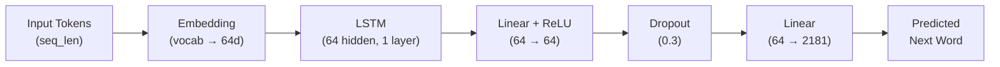

# 🧠 LSTM Next-Word Predictor

A from-scratch language model that predicts the next word in a sequence using an LSTM (Long Short-Term Memory) network — simulating how early neural language models worked before the Transformer era.


---

## ✨ Motivation

Modern LLMs are built on Transformers, but understanding **sequential models like LSTMs** is foundational to appreciating *why* attention mechanisms were needed. This project builds a complete, minimal language model pipeline from scratch — tokenizer, model, training, and deployment — to explore how recurrent networks handle next-word prediction and where they fall short.

The training corpus focuses on **machine learning concepts**, the **LSTM architecture**, and the **"Attention Is All You Need"** paper.

---

## 🏗️ Architecture



| Component        | Details                          |
| ---------------- | -------------------------------- |
| **Embedding**    | 2,181 vocab → 64 dimensions      |
| **LSTM**         | 1 layer, 64 hidden units         |
| **Classifier**   | Linear(64→64) → ReLU → Dropout(0.3) → Linear(64→2181) |
| **Parameters**   | ~1.2 MB                          |

---

## 📁 Project Structure

```
Language Model with LSTM/
├── Lstm One Word Predictor.ipynb   # Training notebook (data prep, training loop)
├── app.py                          # Streamlit web app for inference
├── README.md
├── Loss plot.png                   # Training loss curve
├── Artifacts/
│   ├── mini_lm.pt                  # Saved model weights
│   └── tokenizer.json              # Word-to-ID mapping (custom tokenizer)
└── src/
    └── architecture.py             # WordPred model definition (PyTorch)
```

---

## 🚀 Getting Started

### Prerequisites

```bash
pip install torch streamlit pillow
```

### Run the app

```bash
streamlit run app.py
```

The app will open at `http://localhost:8501`. Enter a prompt related to machine learning or LSTMs and the model will attempt to complete your sentence.

### Train from scratch

Open `Lstm One Word Predictor.ipynb` in Jupyter and run all cells. The notebook handles:

1. Text extraction & cleaning
2. Tokenizer construction
3. Dataset creation (sliding window)
4. Model training (100 epochs)
5. Saving weights to `Artifacts/`

---

## 📈 Results

### Training Loss

The model was trained for **100 epochs** with cross-entropy loss. Training loss decreased steadily from **~7.0 to ~1.0**.

<p align="center">
  
</p>

### Limitations

- **Overfitting** — Only training loss was tracked; the model likely memorised patterns from the small corpus rather than learning generalisable language structure.
- **Small vocabulary** — 2,181 tokens with a custom word-level tokenizer means many inputs produce `<unk>` tokens.
- **Short context** — The model uses the last 30 tokens as context, and a single LSTM layer struggles with long-range dependencies.

---

## 🔮 Future Improvements

- [ ] Add a **validation split** and plot train vs. val loss to quantify overfitting
- [ ] Replace the custom tokenizer with a **sub-word tokenizer** (BPE / SentencePiece)
- [ ] Experiment with **multi-layer LSTMs** or **GRUs**
- [ ] Add **temperature sampling** and **top-k/top-p** decoding for more varied outputs
- [ ] Benchmark with **perplexity** for a quantitative evaluation metric

---

## 🛠️ Built With

- **[PyTorch](https://pytorch.org/)** — Model definition & training
- **[Streamlit](https://streamlit.io/)** — Interactive web interface
- **Custom tokenizer** — Word-level tokenization built from scratch

---

## 📄 License

This project is open source and available for educational purposes.
