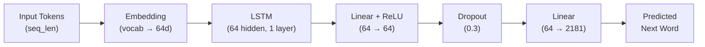

# LSTM Next-Word Predictor

An LSTM-based next-word predictor built from scratch in PyTorch, deployed with Streamlit. This project simulates how language modeling worked in the mid-2010s before Transformers became the standard.

## 💡 Why this project?
While modern LLMs rely entirely on Transformers, recurrent architectures like LSTMs are the foundation of sequence modeling. I built this project to get hands-on experience implementing the entire pipeline from scratch: parsing raw PDFs, building a custom vocabulary/tokenizer, structuring the LSTM sequence model, and running the training loop.

---

## 🏗️ Architecture & Flow

The model maps token sequences to a 64-dimensional embedding space, processes them sequentially through an LSTM layer, and projects the final hidden state to predict the next word probability across the vocabulary.



| Component | Layer Details |
| :--- | :--- |
| **Embedding** | 2,181 vocab size → 64-dimensional dense vectors |
| **LSTM** | 1 layer, 64 hidden units |
| **Classifier Head** | `Linear(64→64)` ➔ `ReLU` ➔ `Dropout(0.3)` ➔ `Linear(64→2181)` |
| **Model Size** | ~1.2 MB |

---

## 📁 Repository Structure

```
├── Notebook/
│   └── Lstm One Word Predictor.ipynb   # PDF extraction, tokenization, training loop
├── src/
│   └── architecture.py                 # PyTorch model definition (WordPred)
├── Artifacts/
│   ├── mini_lm.pt                      # Saved model weights
│   └── tokenizer.json                  # Word-to-ID mapping dictionary
├── app.py                              # Streamlit inference application
├── Loss plot.png                       # Training loss curve
└── README.md
```

---

## 🚀 Getting Started

### 1. Install dependencies
```bash
pip install torch streamlit pillow pypdf pandas numpy matplotlib scikit-learn
```

### 2. Run the Streamlit App
```bash
streamlit run app.py
```

### 3. Retrain the model
To run the full pipeline (extracting text from PDFs, tokenizing, and training the model), run all cells in [Notebook/Lstm One Word Predictor.ipynb](file:///c:/Users/USER/Documents/MY%20PORTFOLIO/Language%20Model%20with%20LSTM/Notebook/Lstm%20One%20Word%20Predictor.ipynb).

---

## 📈 Training Results & Technical Retrospective

The model was trained for **100 epochs** on a custom corpus extracted from the original LSTM paper and the *"Attention Is All You Need"* paper.

<p align="center">
  
</p>

### ⚠️ Performance Bottlenecks

1. **Severe Overfitting**
   The training loss decreased smoothly from `~7.0` to `~1.0`, but the model suffered from heavy overfitting. Because the corpus is small (two academic papers), the model mostly memorized exact phrasing rather than generalizing.

2. **Tokenizer Vocabulary Limits**
   Using a basic word-level tokenizer built from scratch capped the vocabulary at `2,181` tokens. Any word not explicitly in the training papers (including common conversational filler words) maps to the `<unk>` (unknown) token.

3. **Context Length Constraint**
   The model uses a maximum context window of 30 tokens. Because it's a single-layer LSTM, it struggles to retain style or long-term coherence during generation.

---

## 🔮 Planned Improvements

- Gather much more text data for large scale training to improve accuracy
- More sophisticated text cleaning and preprocessing
- Use a more efficient open-source tokenizer

